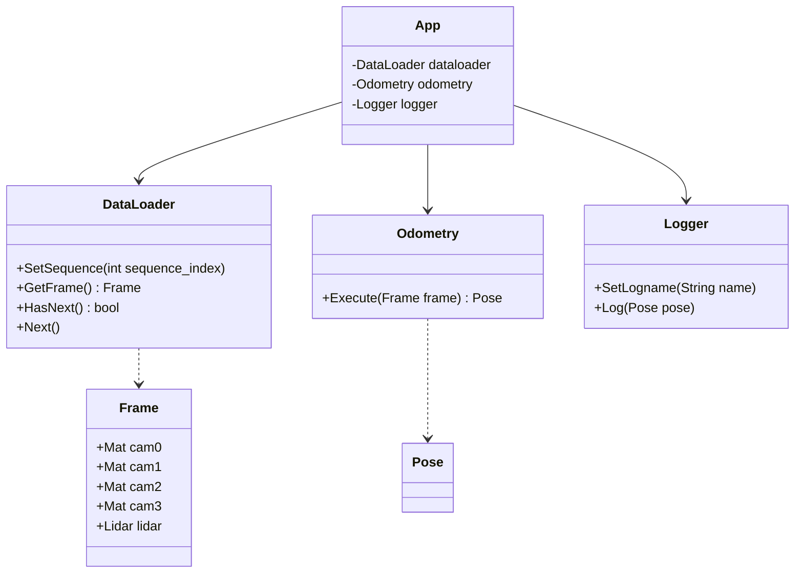

# Slam Research

[toc]

## Architecture

## Misc

conan install --profile ..\conanprofile.txt .. --build=missing
conan install .. --build=missing -s build_type=Debug

Conan remote repository : https://conan.campar.in.tum.de/ui/repos/tree/General/
Conan bincrafters : https://bincrafters.github.io/2020/04/19/infrastructure-changes-and-required-actions/

CMake blog : https://booiljung.github.io/technical_articles/c_language/build_cmake_in_vscode_on_linux.html

github autho : https://docs.github.com/en/authentication/connecting-to-github-with-ssh/generating-a-new-ssh-key-and-adding-it-to-the-ssh-agent